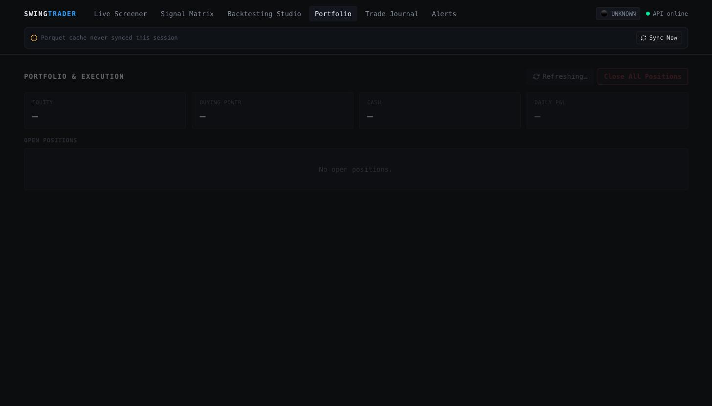
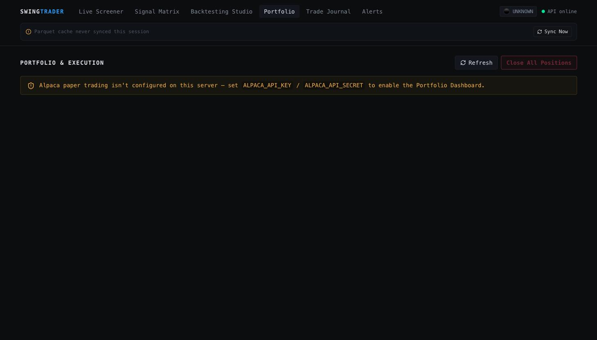
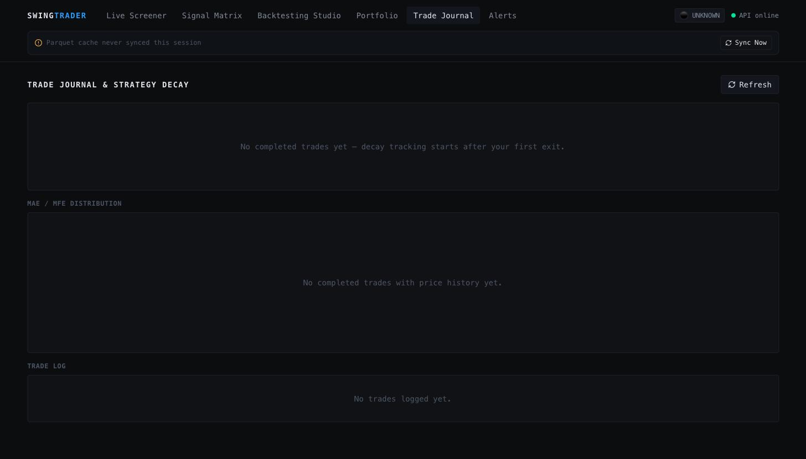
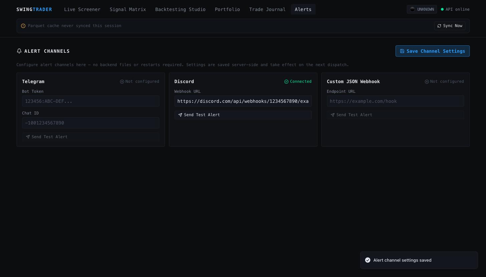

<div align="center">

# SwingTrader

**A quantitative swing/momentum trading research platform.**

Answers one question precisely: *if you put $1,000 into this strategy, what
would you have now — versus buying and holding the same stock, versus the
S&P 500?*

[]()
[]()
[]()
[]()
[]()

[What is this?](#what-is-this) •
[Quickstart](#quickstart-for-first-time-users) •
[Do I need an API key?](#do-i-need-an-api-key) •
[Configuration](#configuration) •
[Hosting](#hosting-it-somewhere-else) •
[Docs](#learn-more)

</div>

---

## What is this?

SwingTrader is two things working together:

1. A **backend** (Python + FastAPI) that runs systematic trading strategies
   through a shared risk engine, then answers "what would $1,000 have
   turned into?" by comparing the strategy's results against **buying and
   holding the stock** and against **the S&P 500 (SPY)** — same starting
   dollar amount, same dates, so the comparison is fair.
2. A **frontend** (React) — a dark, terminal-style web app with eight tabs:
   a **Dashboard** summarizing today's actionable setups and the current
   market regime, a **Live Screener** that scans a watchlist for buy/sell
   setups, a **Signal Matrix** ranking actionable setups across every
   strategy at once, a **Backtesting Studio** where you pick a strategy, a
   ticker, and a date range and get back charts and numbers, a
   **Portfolio** dashboard for the Alpaca paper account (equity, positions,
   emergency close-all), a **Trade Journal** with MAE/MFE and
   win-rate/expectancy decay charts, an **Alerts** tab to configure
   Telegram/Discord/webhook channels from the browser, and a **Historical
   Simulator** for replaying a past date's scan and simulating trade
   execution against it.

You do not need to know how to trade, or write any code, to run this and
click around it. The sections below assume you've never set up a project
like this before.



---

## Quickstart (for first-time users)

### What you need installed first

| Tool | Version | Check you have it | Don't have it? |
|---|---|---|---|
| **Python** | 3.11 or 3.12 | `python3 --version` | [python.org/downloads](https://www.python.org/downloads/) |
| **Node.js** | 20 or newer | `node --version` | [nodejs.org](https://nodejs.org/) (pick the "LTS" version) |
| **Git** | any recent version | `git --version` | [git-scm.com](https://git-scm.com/downloads) |

Run each `Check you have it` command in a terminal. If it prints a version
number, you're set — if it says "command not found," install that tool
first.

> **Tip:** on macOS/Linux, "terminal" means the Terminal app. On Windows, use
> PowerShell, or [Windows Terminal](https://apps.microsoft.com/detail/9n0dx20hk701).

### Do I need an API key?

**No.** SwingTrader works immediately with no signup and no API key —
price data comes from Yahoo Finance (via the free `yfinance` library),
which needs no account.

There's exactly **one optional** upgrade: a free [Finnhub](https://finnhub.io/register)
API key adds real-time quotes to the live screener. Skip it for now — you
can always add it later. Everything in this guide works without it.

### Step 1 — Get the code

```bash
git clone https://github.com/stock-automator/SwingTrader-26.git
cd SwingTrader-26
```

(Already have it? `cd` into the folder you cloned it to instead.)

### Step 2 — Start the backend

A **virtual environment** keeps this project's Python packages separate
from everything else on your computer — it's the standard, safe way to do
this, not an extra hoop.

```bash
python3 -m venv venv              # create it (only needed once)
source venv/bin/activate           # macOS/Linux
# venv\Scripts\activate             # Windows (PowerShell/CMD instead)

pip install -r requirements.txt    # install everything the backend needs
uvicorn backend.app.main:app --reload
```

Leave this terminal window running. You should see something like:

```
INFO:     Uvicorn running on http://127.0.0.1:8000
INFO:     Application startup complete.
```

That means the backend is live. Visit **http://localhost:8000/docs** in a
browser — you should see an interactive API page. If you do, the backend
works.

### Step 3 — Start the frontend

Open a **second** terminal window (leave the first one running) and:

```bash
cd SwingTrader-26/frontend   # from the repo root
npm install                   # only needed the first time
npm run dev
```

You'll see:

```
  VITE ready
  ➜  Local:   http://localhost:5173/
```

### Step 4 — Open it

Go to **http://localhost:5173** in your browser. You should land on the
**Live Screener** tab with a "API online" indicator in the top right — that
green dot means the frontend successfully reached the backend from Step 2.

> **Nothing showing up on the screener?** That's normal on a totally fresh
> checkout with no cached price data yet — the first scan has to fetch bars
> from Yahoo Finance, which takes a few seconds per ticker. Give it a
> minute, or try the Backtesting Studio next (below) with a well-known
> ticker like `AAPL`, which fetches faster since it's a single symbol.

### Mobile / LAN / NordVPN Meshnet access

Both dev servers already bind every network interface, not just
`localhost` - `vite.config.ts` sets `server.host = "0.0.0.0"`, and the
backend's CORS allows any `192.168.*`, `10.*`, or `100.*` origin (the LAN
and Tailscale/NordVPN Meshnet CGNAT ranges) on any port. To reach the app
from a phone or another machine on the same network/Meshnet:

```bash
uvicorn backend.app.main:app --reload --host 0.0.0.0   # instead of Step 2
```

Then on the phone/other device, visit
`http://<this-machine's-LAN-or-Meshnet-IP>:5173` and point the frontend at
the same host's backend by setting `VITE_API_BASE_URL` before `npm run
dev`, e.g. `VITE_API_BASE_URL=http://100.x.x.x:8000 npm run dev` (find your
IP with `ifconfig`/`ip addr` on macOS/Linux, or your Meshnet client's own
IP display).

### Try it: run your first backtest

1. Click **Backtesting Studio** in the top nav.
2. Leave **Strategy** as `Donchian 20-day Breakout` and **Tickers** as `AAPL`.
3. Set **Initial Capital** to `1000` (it already defaults to this).
4. Click **Run Backtest**.

After a few seconds you'll see a headline like *"$1,000 grown to $1,138 vs
$1,070 buying & holding AAPL"*, a chart comparing three lines (your
strategy, buy & hold, and SPY), and a table of every trade the strategy
would have made. That's the whole platform in one click.

### Try it: Portfolio, Trade Journal, and Alerts

These three tabs work without any extra setup, but show the most once
you've configured what they talk to:

- **Portfolio** needs `ALPACA_API_KEY`/`ALPACA_API_SECRET` (see
  [Configuration](#configuration)) — without them it shows a calm "not
  configured" notice instead of an error. With them set, it shows your
  Alpaca **paper** account's equity/cash/buying-power, an equity curve, your
  open positions, and an emergency **Close All Positions** button (behind a
  confirmation modal — it's a real, if paper-money, destructive action).

  

- **Trade Journal** reads whatever's in `JOURNAL_PATH` (default
  `data/trades_live.csv`, empty on a fresh checkout) — win rate,
  expectancy, rolling 30/60/90-day decay vs. the all-time baseline, and a
  MAE/MFE scatter chart across every completed trade. Empty until you've
  logged and closed at least one trade through `journal.executor.TradeJournal`.

  

- **Alerts** needs nothing to *open* — click **Alerts** in the top nav, paste
  a Telegram bot token + chat ID, a Discord webhook URL, or a generic
  webhook URL, click **Save Channel Settings**, then **Send Test Alert** on
  that channel to confirm it actually works. No `.env` edit or restart
  required — see [`ALERT_CONFIG_PATH`](#configuration).

  

> Screenshots above are a real, freshly-checked-out local run — no Alpaca
> credentials, no journal history, and a Discord webhook saved live through
> the UI to show the round trip. That's also why they're a good source of
> truth: nothing in them is staged data.

### Running the tests (optional, for the curious)

```bash
pip install -r requirements-test.txt
pytest tests/ -v
```

You should see `848 passed`. This isn't required to use the app — it's how
you'd confirm nothing is broken if you change any code. For the frontend's
Playwright end-to-end suite (tab switching, filtering, paper-trade
submission, modal confirmations, error toasts — all against a mocked
backend, no live API needed):

```bash
cd frontend
npx playwright install chromium   # once
npx playwright test
```

---

## Configuration

Everything below is **optional** — the app runs correctly with none of it
set. To customize any of it, copy `.env.example` to a new file named `.env`
in the repo root and edit the values there; the backend reads it
automatically on startup.

```bash
cp .env.example .env
```

| Variable | Default | What it does |
|---|---|---|
| `FINNHUB_API_KEY` | *(unset)* | Adds real-time quotes to the live screener. Get a free one at [finnhub.io/register](https://finnhub.io/register). Without it, the screener uses Yahoo Finance data instead — fully functional, just not tick-by-tick. |
| `ALLOW_DOWNLOADS` | `true` | Whether the backend may fetch a ticker it doesn't have cached. Set to `false` to run fully offline against only what's already downloaded. |
| `DATA_DIR` | `data/raw` | Folder where downloaded price data is cached, so repeat requests don't re-download. |
| `CORS_ORIGINS` | `http://localhost:5173,http://127.0.0.1:5173` | Which frontend URLs the backend will accept requests from. Only change this if you're hosting the frontend somewhere other than your own machine. |
| `WATCHLIST_PATH` | `config/watchlist.txt` | The list of tickers the live screener scans (one per line — already comes with ~500 S&P 500-ish names). |
| `SCREENER_MAX_TICKERS` | `750` | Caps how many tickers one screener scan checks — a safety valve against an accidentally enormous watchlist, not a throttle (loading is parallelized, see below). |
| `SCREENER_MAX_WORKERS` | `16` | Thread-pool size used to fetch tickers concurrently; also the de facto rate limit against the data provider. |
| `SCREENER_MIN_AVG_VOLUME` | `100000` | Tickers below this trailing average daily volume are skipped as `VOLUME_FILTER_FAILED` rather than scanned. |
| `SCREENER_VOLUME_LOOKBACK` | `20` | Trailing bar count `SCREENER_MIN_AVG_VOLUME` is averaged over. |
| `SCREENER_STALE_AFTER_DAYS` | *(unset)* | Skip a ticker as `DATA_STALE` if its most recent cached bar is older than this many days. Unset disables the check. |
| `WS_POLL_SECONDS` | `15` | How often the live screener pushes a fresh scan over its live connection. |
| `MAX_BACKTEST_TICKERS` | `10` | Caps how many tickers one backtest request can run at once. |
| `JOURNAL_PATH` | `data/trades_live.csv` | Where the trade journal (entries/exits/MAE-MFE/decay analytics) reads and writes its CSV. |
| `TELEGRAM_BOT_TOKEN` / `TELEGRAM_CHAT_ID` | *(unset)* | Telegram alert channel for `POST /api/v1/alerts/dispatch`; both must be set to activate it. |
| `DISCORD_WEBHOOK_URL` | *(unset)* | Discord alert channel (incoming webhook). |
| `GENERIC_WEBHOOK_URL` | *(unset)* | Generic HTTP alert channel — setups are POSTed here as flat JSON. |
| `ALERT_CONFIG_PATH` | `config/alerts_channels.json` | Where the Alerts tab's **Save Channel Settings** persists Telegram/Discord/webhook credentials, so they can be configured from the browser without editing `.env` or restarting. A field saved here overrides the matching variable above; gitignored, since it can hold real secrets. |
| `ALPACA_API_KEY` / `ALPACA_API_SECRET` | *(unset)* | Alpaca **paper-trading** credentials for `/api/v1/execution/*`. The SDK always points at Alpaca's paper endpoint regardless of these values — there is no setting that makes this platform place live orders. |
| `EXECUTION_GUARDS_ENABLED` | `true` | Whether `POST /api/v1/execution/orders` runs the session-clock and earnings/split lockout guards before dispatching (see `execution/guards.py`). Only turn off for local/paper testing outside market hours. |
| `EXECUTION_ALLOW_EXTENDED_HOURS` | `false` | Whether pre-market/after-hours count as dispatchable sessions (still illiquid) instead of being blocked like a closed market. |
| `EARNINGS_LOCKOUT_HOURS` | `48` | Hours before/after a scheduled earnings release or stock split during which `POST /api/v1/execution/orders` refuses a new entry. |

> **Never commit a real `.env` file.** It's already excluded via
> `.gitignore` — only `.env.example` (with no real keys in it) is tracked.

---

## Hosting it somewhere else

The instructions above run everything on your own laptop, which is the
right starting point. If you want a "start it with one command" local setup
instead of two separate terminals, or you're ready to put it somewhere
other people can reach:

### Option A — One command, still on your own machine (Docker)

Install [Docker Desktop](https://www.docker.com/products/docker-desktop/),
then from the repo root:

```bash
docker compose up --build
```

Open **http://localhost:8080**. This builds and runs both the backend and
frontend in containers — no Python or Node setup needed at all. Stop it
with `Ctrl+C`, or `docker compose down`.

### Option B — A real deployment (cloud hosting)

This repo's CI automatically builds a container image of the backend and
one of the frontend on every push to `main` and publishes them to GitHub
Container Registry (see `.github/workflows/deploy.yml`) — that's the
artifact you'd hand to a hosting provider (a VPS, Fly.io, Render, AWS/GCP/
Azure, etc.). There's no live, publicly-hosted instance of this app today;
wiring one up means picking a host, pointing it at those published images,
and setting `FINNHUB_API_KEY`/`CORS_ORIGINS` for that environment. That's a
deliberate, separate decision this repo doesn't make for you — nothing here
requires paid infrastructure to *use* it, only to make it reachable by
someone other than you.

---

## Architecture, for the curious

```
data/raw/*.parquet, yfinance  ──►  BaseStrategy.generate_signals
                                          │
                                          ▼
                                   RiskManager.build_order
                                          │
                              ┌───────────┴───────────┐
                              ▼                        ▼
                   quant/engine.py (backtest)   quant/setups.py (live screener)
                              │                        │
                              ▼                        │
                   quant/backtest.py                   │
                   ($1,000 vs buy&hold vs SPY)          │
                              │                        │
                              └───────────┬────────────┘
                                          ▼
                                   backend/app/api/*
                              (FastAPI REST + WebSocket)
                                          │
                                          ▼
                                   frontend/ (React)
```

See **[`docs/architecture.md`](docs/architecture.md)** for the full
walkthrough, including where the live `/ws/screener` connection fits.

A strategy only looks at price history and returns direction + relative
stop/target sizing; `RiskManager` is the only thing that knows about account
equity and converts that into shares and absolute prices; the engines
(`quant/engine.py` for full-history replay, `quant/setups.py` for the live
screener) are the only things that simulate execution. This separation, the
exact strategy output schema, and the steps for adding a new strategy are
documented in **[`AGENTS.md`](AGENTS.md)** — note that document predates this
refactor and still refers to the code's old `src/` location; the same
contracts now live under `backend/app/quant/`, `backend/app/data/`,
`backend/app/journal/` and `backend/app/analytics/`.

## The API, briefly

Full reference with request/response shapes and curl examples:
**[`docs/api.md`](docs/api.md)**.

- **`POST /api/v1/backtest`** — run a strategy over one or more tickers and
  get back three aligned dollar equity curves (strategy, buy & hold, SPY),
  their summary stats, and alpha/beta/Sharpe/information-ratio relative to
  each benchmark. See **[`docs/benchmark_math.md`](docs/benchmark_math.md)**
  for exactly how those numbers are computed.
- **`GET /api/v1/screener/live`** — the latest-bar setup (LONG / SHORT /
  EXIT_LONG / FLAT) for every ticker in the watchlist, sized against a
  notional account.
- **`WS /ws/screener`** — the same scan, pushed on an interval, for the live
  dashboard.
- **`GET /api/v1/signals/live-today`** — the same idea across *every*
  registered strategy at once, flattened into one cross-strategy "what to
  look at today" grid (the frontend's Signal Matrix tab). Each LONG row
  carries a real `win_probability` from `analytics/expectancy.py` — a
  regime-matched historical backtest win rate, or a block-bootstrap Monte
  Carlo percentile when there aren't enough same-regime trades, or `null`
  when there isn't enough trade history for either. See
  [Win probability, briefly](#win-probability-briefly) below.
- **`POST /api/v1/backtest/historical-date-scan`** — the live screener's
  logic, but frozen at a `target_date` in the past with the frame sliced to
  `<= target_date` first, so it's structurally impossible for it to see data
  that wasn't available yet (zero lookahead bias).
- **`POST /api/v1/backtest/simulate-trade-execution`** — prices a single
  simulated fill (`NEXT_OPEN` or `SAME_CLOSE_SLIPPAGE`) with configurable
  slippage/commission/fee, for sanity-checking a signal's realistic entry.
  Also reports a per-bar ATR-implied `spread_pct`, an opt-in volume-based
  `market_impact_pct`, and `spread_variance_pct` (see
  [Execution drag, briefly](#execution-drag-briefly)).
- **`POST /api/v1/alerts/dispatch`** — sends a message to whichever of
  Telegram / Discord / a generic webhook are configured; on-demand only,
  nothing auto-fires from a scan.
- **`GET`/`PUT /api/v1/alerts/config`**, **`POST /api/v1/alerts/test`** —
  backs the Alerts tab: persist channel credentials from the browser
  (`ALERT_CONFIG_PATH`, no `.env` edit or restart) and fire a test message
  at exactly one channel.
- **`POST /api/v1/execution/orders`**, **`/close-all`**, **`GET
  /api/v1/execution/account`**, **`/positions`**, **`/portfolio-history`** —
  Alpaca **paper-trading** order placement (market/limit/bracket), an
  emergency flatten-everything switch, and the account/positions/equity-curve
  reads behind the Portfolio Dashboard. 503 if no Alpaca credentials are
  configured. `/orders` also runs the session-clock and earnings/split
  lockout guards first (`execution/guards.py`) — a 422 means the order was
  never sent to Alpaca at all. `/close-all` is deliberately never guarded:
  an emergency flatten must always be reachable.
- **`GET /api/v1/journal/summary`**, **`/decay`**, **`/trades`**, **`/mae-mfe-distribution`**,
  **`POST /api/v1/journal/mae-mfe`** — trade-journal analytics: win
  rate/expectancy, 30/60/90-day performance decay, the raw trade log, and
  per-trade (or whole-journal) max adverse/favorable excursion — the data
  behind the Trade Journal tab's charts.
- **`GET /api/v1/data/sync/status`** / **`POST /api/v1/data/sync`** — kicks
  off (and reports progress on) a background Parquet cache refresh; the
  frontend's header sync banner polls this.
- **`GET /api/v1/health`** — liveness + which optional data providers are
  configured.

### Win probability, briefly

`analytics/expectancy.py` answers "how often has this actually worked,"
computed two ways depending on how much history backs it, and never a
fabricated number:

1. **Regime-matched historical backtest** — run the same strategy over the
   ticker's own full price history, tag each closed trade with the market
   regime (`quant/regime.py`) active when it was entered, and take the win
   rate of trades entered in the *same* regime as today's setup. Used once
   at least 12 same-regime trades exist.
2. **Block-bootstrap Monte Carlo percentile** — below that, resample the
   *whole* trade history's win/loss sequence in contiguous blocks (so
   win/loss streaks survive the resample) many times and report the
   resampled distribution's median win rate plus a 5th/95th percentile band.
   Used once at least 8 total closed trades exist.
3. **`null`** — below 8 trades total, there isn't enough history for either
   method to mean anything, so `win_probability` stays `null` — the same
   honesty the old always-`null` placeholder had, just reserved for when
   it's actually true. Also always `null` for SHORT rows: the backtest
   engine is long-only, so there is nothing to estimate from.

Every row's `win_probability_method`, `win_probability_sample_size`, and
(for the bootstrap case) `win_probability_confidence_low`/`_high` explain
exactly which of the above produced the number.

### Execution drag, briefly

`quant/slippage_model.py` prices a single simulated fill more precisely than
a whole-backtest-run average can: `spread_pct` is this specific bar's
ATR-implied bid/ask spread (a volatile stretch of a ticker's history gets a
wider spread than a quiet stretch of the *same* ticker), `market_impact_pct`
is an opt-in (`impact_coefficient > 0`) square-root participation-rate cost
for orders that are large relative to the ticker's trailing volume, and
`spread_variance_pct` is how much the spread estimate itself has moved
recently — a confidence read on `spread_pct`, not just a point estimate.
`fill_price` reflects both `spread_pct` and `market_impact_pct` together;
`slippage_cost` is the resulting dollar drag against the ideal (spread- and
impact-free) reference price.

## Project layout

```text
backend/
  app/
    main.py              FastAPI app, CORS, health check
    config.py             Environment-driven Settings (.env aware)
    api/                  Routes: backtest.py, screener.py, signals.py,
                           replay.py, alerts.py, execution.py, journal.py,
                           data_sync.py, schemas.py, deps.py
    quant/                Strategy engine: strategies/ (10 registered),
                           engine.py, risk.py, regime.py, indicators.py,
                           setups.py, screener.py, backtest.py (the $1,000
                           benchmark), metrics.py, slippage_model.py
                           (per-bar spread + market impact)
    alerts/                Telegram/Discord/webhook dispatch (dispatcher.py)
    execution/             Alpaca paper-trading client wrapper, guards.py
                           (session clock + earnings/split lockout)
    data/                 Price loading/caching (loader.py, agent.py)
    journal/              Trade journal persistence + decay/MAE-MFE analytics
    analytics/             Console/report rendering, expectancy.py
                           (win-probability engine)
frontend/
  src/                    React + Vite + Tailwind UI (lightweight-charts,
                           Recharts, TanStack Table); Signal Matrix grid,
                           sync status banner, toasts, Framer Motion tab
                           transitions
    components/portfolio/  Alpaca account/positions/equity-curve, close-all
    components/journal/    MAE/MFE distribution, decay charts, trade log
    components/alerts/     Telegram/Discord/webhook channel settings
  e2e/                    Playwright suite: smoke, portfolio, journal,
                           alerts, signals (filtering, paper-trade, toasts)
docs/
  architecture.md          Data-flow diagram, backend/frontend separation
  api.md                   Full endpoint reference
  benchmark_math.md         Alpha/beta/Sharpe/information-ratio, explained
  code_review.md            Multi-persona review of this codebase
  media/                    Demo video recordings
scripts/
  generate_demo_videos.py  Playwright walkthrough recorder
tests/                     pytest suite, one file per backend/app module
config/
  watchlist.txt             Ticker universe the screener scans
data/raw/                  Cached OHLCV parquet files
docker-compose.yml          One-command local run via Docker
AGENTS.md                  Engineering contract for strategies/risk/engines
```

## Learn more

- **[`docs/architecture.md`](docs/architecture.md)** — full data-flow diagram
- **[`docs/api.md`](docs/api.md)** — every endpoint, request/response shapes, curl examples
- **[`docs/benchmark_math.md`](docs/benchmark_math.md)** — exactly how alpha/beta/Sharpe are computed
- **[`docs/code_review.md`](docs/code_review.md)** — a multi-persona review of this codebase
- **[`AGENTS.md`](AGENTS.md)** — the engineering contract for strategies, risk sizing, and the backtest/screener engines

## Status

The project began as a Yahoo Finance historical-data pipeline and evolved
into a systematic momentum/swing-trading research platform: a stock
universe of 500+ tickers cached locally as Parquet, a modular strategy
framework, a risk manager, full-history and live-screener engines, and now
a FastAPI + React application on top of all of it. The target account size
for eventual live deployment is small (low four figures); risk management
takes priority over raw historical return, and a backtest is treated as
evidence for further investigation, not proof of anything.

**Where this stands today**, roughly in the order it was built:

1. Historical data pipeline, modular strategy framework, risk manager,
   backtest/forward-test engines, analytics (original CLI-era foundation).
2. Risk engine & position sizing, market-regime detection, first strategy
   set (`donchian_breakout`, `moving_average_cross`, `vcp_breakout`,
   `relative_strength`).
3. Full-stack refactor onto FastAPI + React, the $1,000-vs-buy&hold-vs-SPY
   benchmark backtester, and the live setup screener (REST + WebSocket).
4. **Scanner reliability + strategy library expansion**: the live screener
   silently truncated a full watchlist to 60 tickers and loaded them one at
   a time; fixed with a raised, transparent cap, concurrent thread-pooled
   loading with retry/backoff, and explicit skip-reason categorization
   (`INSUFFICIENT_HISTORY` / `DATA_STALE` / `VOLUME_FILTER_FAILED` /
   `ZERO_LIQUIDITY`). Strategy count went from 4 to 10, adding volatility
   (`bollinger_keltner_squeeze`, `kama_trend`), mean-reversion
   (`zscore_mean_reversion`, Hurst-filtered), momentum
   (`supertrend_psar`, `dual_momentum`), and market-structure
   (`obv_divergence`) coverage.
5. Cross-strategy signal matrix, point-in-time historical replay (zero
   lookahead by construction), trade execution simulation, multichannel
   alerts (Telegram/Discord/generic webhook), Alpaca paper-trading order
   placement + emergency close-all, trade-journal decay analytics (MAE/MFE,
   30/60/90-day win-rate/expectancy windows), a real win-probability engine
   (regime-matched historical backtest, falling back to a block-bootstrap
   Monte Carlo percentile), and the matching frontend surface: a real-time
   data-sync banner, the Signal Matrix grid (sortable/filterable, one-click
   paper-trade action), toast notifications, and animated tab transitions.
6. **This round** — the frontend panels for the backend surfaces §5 shipped
   without one: a **Portfolio Dashboard** (Alpaca account/positions/equity
   curve, emergency close-all behind a modal), an **Alert Channel
   Configuration UI** (Telegram/Discord/webhook, no `.env` edit needed —
   backed by two new endpoints, `GET`/`PUT /api/v1/alerts/config` and
   `POST /api/v1/alerts/test`), and a **Trade Journal & Strategy Decay**
   view (MAE/MFE scatter chart, rolling win-rate/expectancy vs. baseline —
   backed by two new endpoints, `GET /api/v1/journal/trades` and
   `/mae-mfe-distribution`). Also fixed the Signal Matrix's Win Prob.
   column, which was still hard-coded to `—` from before §5's win-probability
   engine landed. Playwright coverage expanded from one smoke test to 11
   tests across 5 spec files (tab switching, filtering, paper-trade
   submission, modal confirmations, configured/unconfigured empty states,
   error toasts).
7. **Sprints 4-6.1** — Unified Dashboard, Historical Simulator, universe
   sync, async DuckDB-backed background scans; market regime engine, ATR
   position sizer, broker-agnostic order routing, the unified live-feed
   WebSocket, and mobile/Meshnet access; then a repo-wide dead-code/
   documentation audit. Detailed per-sprint changes moved to
   `SPRINT_CHANGELOG.md` starting here rather than growing this list
   further — that file is now the canonical record.
8. **Sprint 6 Phase 3 (this round)** — performance and resilience pass, no
   new user-facing features: parallelized the universe-sync symbol filter
   and closed an event-loop-blocking gap in the analytics endpoints
   (`run_in_threadpool` around data loading, not just the backtest
   computation that followed it); added DuckDB indexes and a short-TTL
   cache for the market-regime computation (shared between the REST
   endpoint and the live-feed WebSocket, removing a duplicated
   computation); a global FastAPI error handler so an unexpected backend
   exception now returns a consistent JSON error instead of an
   unformatted one; and a React error boundary around every tab, so a
   bug in one tab's render shows a "Something went wrong — try switching
   tabs and back, or reload the page" message in that tab instead of
   blanking the whole app. See `SPRINT_CHANGELOG.md` for the full list.

**Deliberately not done yet** (so the next session doesn't have to rediscover
this by reading code):

- The Trade Journal's decay baseline is the journal's own all-time
  expectancy/win-rate (`GET /api/v1/journal/summary`), not a per-strategy
  backtest result — `trades_live.csv` has no strategy-attribution column, so
  there's no way to join a logged trade back to the backtest that would have
  predicted it without adding one.
- Logging entries/exits into the trade journal is still done via the
  `TradeJournal` class directly (script/notebook) — there is no "log this
  fill" UI action yet; the frontend is read-only against the journal.
- Statistical-arbitrage pairs trading (cointegration/Johansen) and the
  macro/cross-asset strategies (yield curve, VIX term structure, COT
  positioning, intermarket lead-lag, seasonality) were scoped out of the
  strategy library expansion — they need a multi-symbol architecture and new
  data sources (COT reports, yield curves) beyond the current single-ticker
  `BaseStrategy` interface and Parquet/yfinance pipeline.
